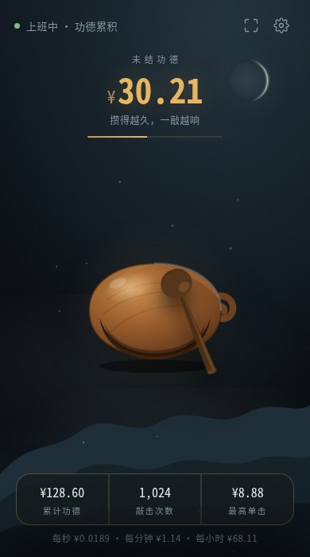
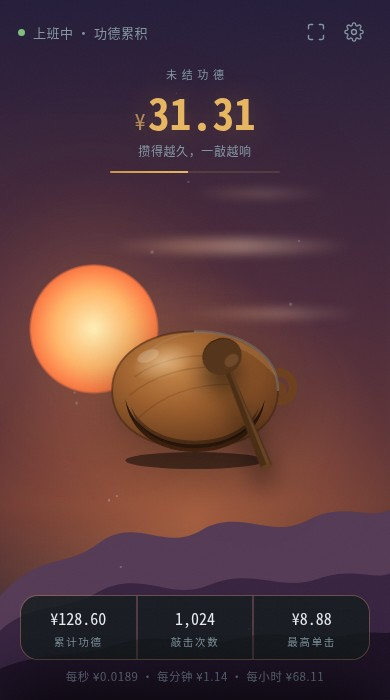
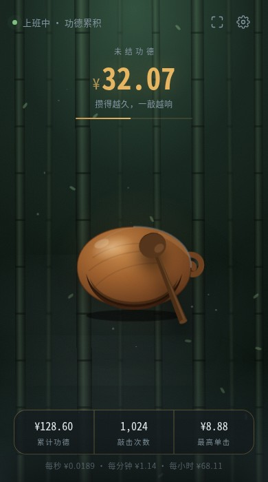
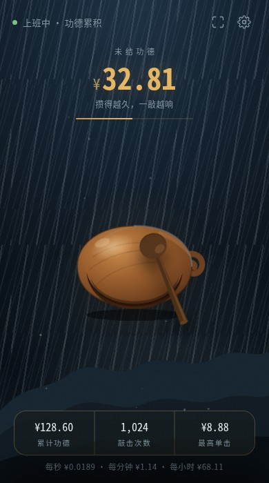
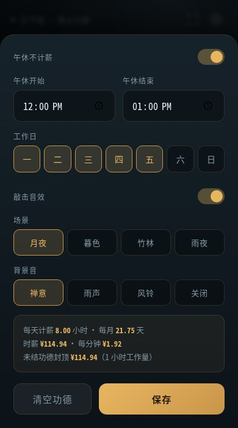

# 赛博木鱼 · 功德即工资

**在线体验 → https://limumu1997.github.io/muyu/**

输入薪资和班表，算出你每一秒值多少钱。**不敲的时候功德一直叠加，敲一下全部收走**——攒得越久，一敲越响。

纯原生 HTML/CSS/JS，零依赖、零构建，双击 `index.html` 就能用，也可以直接扔任意静态托管。

<p align="center">
  
  
  
  
</p>
<p align="center"><sub>四套场景：月夜 · 暮色 · 竹林 · 雨夜——全是 CSS/SVG 现场画的，没有一张图片</sub></p>

## 玩法

- 只在**你设定的上班时段内**累计（午休、非工作日、下班后都不走表）
- 未结功德封顶 **1 小时工作量**——摸太久了会提示你赶紧敲，超出的时间白流
- 敲击结算进累计功德，记录敲击次数和最高单击

## 计算方式

```
每秒收入 = 月薪 ÷ (每月计薪天数 × 每日计薪秒数)
每日计薪秒数 = 下班 − 上班 − 落在班内的午休
未结功德 = 每秒收入 × min(距上次敲击的计薪秒数, 3600)
```

支持跨夜班（如 22:00–06:00，按开班日判断工作日）。

## 画面与声音

全部现场生成，**没有一个图片或音频文件**（README 里这几张截图除外）：

### 四套场景

| 场景 | 画法 |
| --- | --- |
| **月夜** | SVG 三层远山做空气透视 + 漂移的雾与浮尘 + 按农历盈亏的月亮 |
| **暮色** | 落日一半沉进山脊，暖色云带缓慢横移，山影跟着染成紫调 |
| **竹林** | 八根竹子分三层景深，远的细而虚、近的粗而实，风过时整片轻摆，竹叶旋转飘落 |
| **雨夜** | 两层雨幕以不同角度和速度错开（等间距会像百叶窗），底部一层水光起伏 |

雾和雨都用渐变而不是 `filter:blur`，省 GPU。切换场景是 1.2 秒交叉淡入，同一份 DOM 靠 `body[data-scene]` 决定谁露面。

### 月相

月亮按**农历**显示残缺——农历月就是朔望月，初一为朔、十五前后为望，所以月龄直接决定缺法。亮面画成「外缘半圆 + 终结线椭圆弧」：终结线是圆在斜光下的投影，本质是椭圆，**拿两个圆去相交是画不出正确月牙的**（那是最常见的偷懒画法）。月龄用平均朔望月推算，不算摄动，误差半天以内；朔前后保留一道最细的牙，纯属为了画面别空一块。

### 敲击音

模态合成，**敲不同部位声音不同**：中间腔体空、壁薄，敲下去沉且余韵长；越靠边壁越厚实，腔体带不动，只剩短促发脆的木头声，音高还偏高。甜点在开口槽正上方那块鼓面，不是几何圆心。

| 落点 | 余韵 | 音高 | 起音谱重心 |
| --- | --- | --- | --- |
| 甜点 | 150 ms | ×1.02 | 1225 Hz |
| 边缘 | 69 ms | ×1.36 | 2130 Hz |

听起来像木头而不是电子木琴，靠三件事：**高频阻尼远大于低频**（一道从 5 kHz 扫到 1 kHz 的低通，谱重心 30 ms 内从 1225 Hz 坠到 696 Hz）、模态比例排得密而不规则（整数比会变成钟）、每个模态配一份窄带噪声当木纤维底噪。

### 四套背景音

现场合成，同样没有音频文件：

- **禅意**：低频 drone + D 宫五声音阶随机长音 + 偶尔一记磬
- **雨声**：粉噪过低通就是雨，极慢 LFO 扫截止频率做出雨势大小，檐下疏落几声滴水
- **风铃**：三角波，几个不成谐的音成串响起，长余韵
- **关闭**

全部过一个程序生成的混响。首次点击后才启动（浏览器不允许无交互自动播放），切到后台自动停。

想调音色：`app.js` 顶部的 `F0` 是敲击音高（大木鱼降到 ~380，小木鱼 ~700），`SCALE` 是禅意背景音的音阶，`timbreAt()` 是落点到音色的映射。

<p align="center"></p>

## 用法

直接开 https://limumu1997.github.io/muyu/ 就能用。手机上用浏览器菜单「添加到主屏幕」可以装成 App，装完断网也能敲。

本地跑：

```bash
# PWA / Service Worker 需要 http，file:// 下不生效
python3 -m http.server 8765
# 打开 http://127.0.0.1:8765
```

首次打开自动弹设置面板，填月薪即可开始。空格 / 回车也能敲，场景和背景音在设置里随时切换、即时生效。

安卓可以点顶栏的全屏按钮。**iOS 不给网页全屏**（系统限制，只有 video 例外），iPhone 上请用「添加到主屏幕」，从桌面图标启动就是全屏。另外 **iPhone 侧边静音键拨到静音时网页音频会被系统整体屏蔽**，听不到声音先检查这个。

## 文件

| 文件 | 说明 |
| --- | --- |
| `index.html` | 页面结构，木鱼与木槌均为内联 SVG |
| `style.css` | 全部样式与动画 |
| `app.js` | 班表计算、结算逻辑、Web Audio 合成木鱼音与背景音 |
| `sw.js` / `manifest.webmanifest` / `icon.svg` | PWA，可装到手机桌面、离线可用 |

## 数据

薪资配置和功德记录都存在浏览器 `localStorage`（`muyu.cfg` / `muyu.state`），不上传任何地方。设置面板里的「清空功德」可重置记录。
